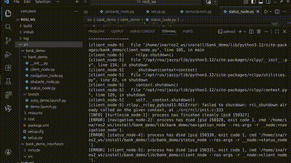

# ROS 2 Turtle Navigation Project (Jazzy)

本项目基于 **Ubuntu 24.04** 与 **ROS 2 Jazzy** 开发，实现了一个具备自恢复能力的乌龟自主导航系统。

---

## 🎥 实时演示 (Live Demo)



> 💡 **演示说明**：上方为自动播放的预览图。如需查看 1080P 高清录像及终端详细日志，请查看：[项目高清原片 (MP4)](./turtle_navigation_demo.mp4)。

### 核心攻克：(2.30, 4.92) 坐标点死锁逻辑
视频中展示了当小乌龟在特定浮点数坐标发生“计算卡顿”时，系统如何通过 **Force-Forward (强制推进)** 算法打破状态机死锁并平滑转向目标点。

---

## 🏗️ 系统架构 (System Architecture)

本项目采用模块化节点设计，确保了控制逻辑与底层仿真的解耦。

### 1. 计算图逻辑 (Computational Graph)

```mermaid
graph TD
    Client[Client Node] -- "Service: SetGoal (x,y)" --> Nav[Navigation Node]
    Obs[Obstacle Node] -- "Topic: /stop_signal (Bool)" --> Nav
    Nav -- "Topic: /turtle1/cmd_vel (Twist)" --> Sim[Turtlesim]
    Sim -- "Topic: /turtle1/pose (Pose)" --> Nav
    
    style Nav fill:#3498db,stroke:#2980b9,color:#fff
    style Sim fill:#2ecc71,stroke:#27ae60,color:#fff
